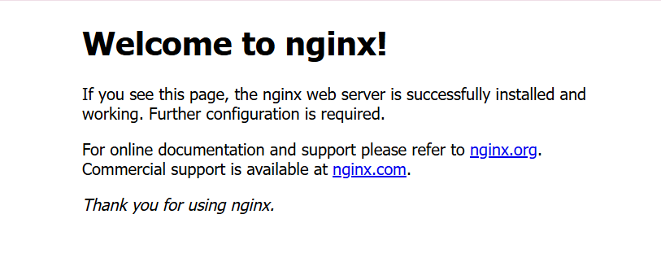
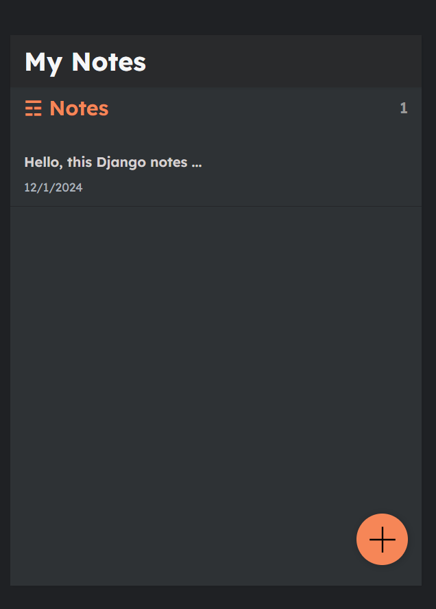
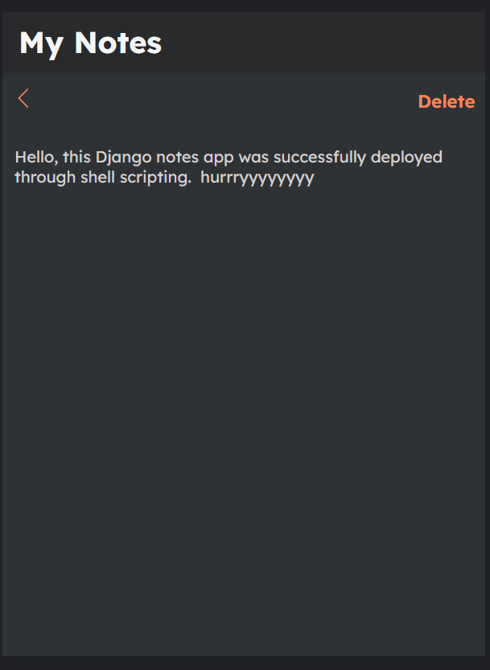

---

# 🌟 Shell Scripting Made Easy!

### 🚀 What is Shell Scripting?
Shell scripting is a way to interact with the operating system using **shell commands** (e.g., Linux commands). Think of it as a powerful tool to communicate with your system and automate tasks. 

📌 **Examples of shell commands**:  
- `ls`  
- `touch`  
- `mkdir`  
- `man`  
- `pwd`  

💡 **Automation**:  
Automation is all about reducing manual work by creating scripts that can perform tasks for you. Shell scripting is perfect for automating repetitive processes!

---

### ✍️ How to Write a Shell Script

1. **Create a file with a `.sh` extension.**  
   Example: `myscript.sh`
2. **Write your script inside the file.**  
   Use a text editor like `nano`, `vim`, or any IDE.
3. **Save the file.**  
   Remember where you save it!
4. **Execute the script.**  
   You can run it in two ways:
   - Using `./filename.sh`
   - Using `sh filename.sh`

---

### 🛠️ Common Shebangs in Shell Scripting

When writing a shell script, the first line usually begins with a **shebang** (`#!`) to specify the interpreter. Here are the commonly used ones:

- `#!/bin/bash`  
- `#!/bin/dash`  
- `#!/bin/sh`  
- `#!/bin/ksh`  

Each interpreter has its own syntax and features. **Bash** (`#!/bin/bash`) is the most widely used due to its versatility and rich feature set.

---

### 📜 Shell Script Examples

#### 🟢 **Installing NGINX**
Below is a shell script to automate the installation of the NGINX web server:  
![Shell script to install NGINX]

---

#### 📝 **Deploying a Django Notes App**
Here’s a shell script for deploying a Django-based notes app:  
![Shell script to install Django Notes App]
  
![Shell script to run Django Notes App]

---

💡 **Pro Tip**: Always test your scripts on a development or test environment before deploying them in production. Automation is powerful, but with great power comes great responsibility! 🛡️

🎉 **Happy Scripting!**

---

Let me know if you’d like further refinements or additional sections!